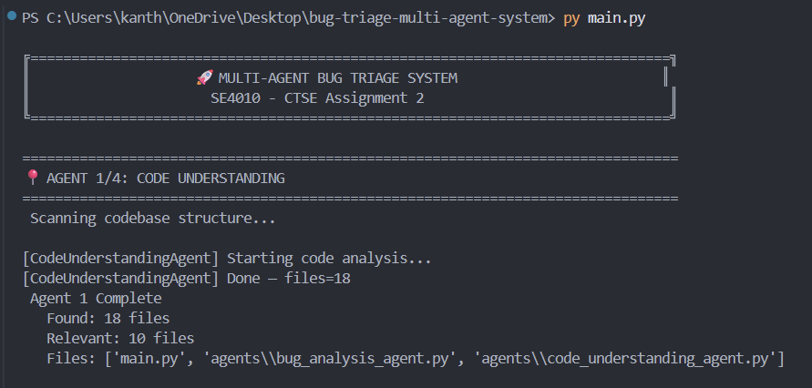
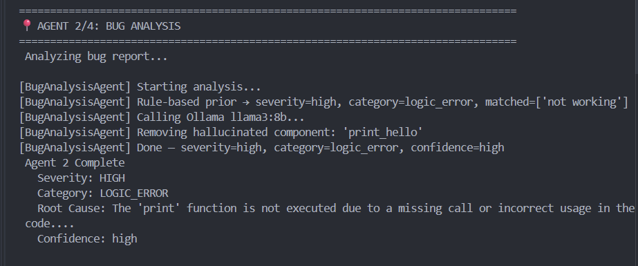
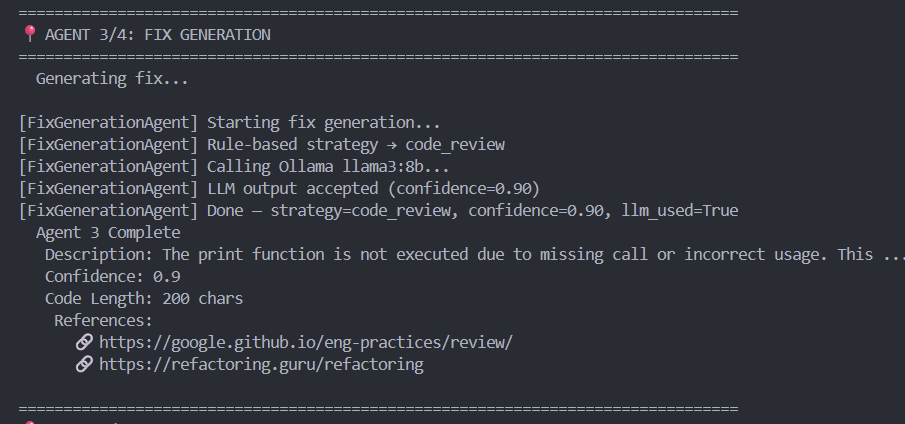
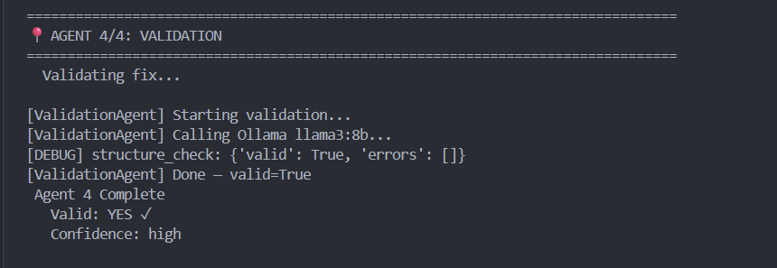
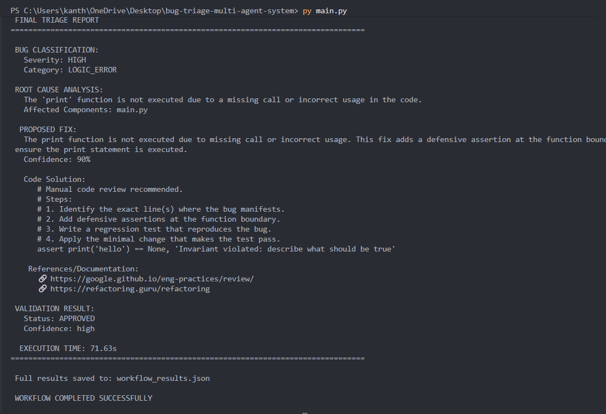

# Bug Triage Multi-Agent System

A fully automated, locally-hosted AI system that performs intelligent software bug triage. It analyzes bug reports, scans codebases, identifies root causes, generates fix recommendations, and validates them—all powered by local LLMs and orchestrated with LangGraph.

**No cloud dependency. No API keys. Fully offline.**

---

## Table of Contents
- [Application Overview](#application-overview)
- [Quick Start](#quick-start)
- [Installation](#installation)
- [Running Commands](#running-commands)
- [Project Architecture](#project-architecture)
- [System Features](#system-features)
- [Testing](#testing)
- [Screenshots](#screenshots)

---

## Application Overview

### What Does It Do?

This system automates the entire bug triage workflow:

1. **Input:** A bug report (text description) + codebase path
2. **Process:** 4 specialized AI agents work in sequence
3. **Output:** Validated bug analysis + recommended fix

### Why Use It?

- Automated: No manual bug analysis needed
- Offline: Runs entirely locally with Ollama (no internet required)
- Accurate: Multi-layer validation prevents AI hallucinations
- Testable: Comprehensive test suite (60+ tests)
- Extensible: Modular agent architecture

---

## Quick Start

### Prerequisites
- Python 3.10+
- Ollama installed locally (ollama serve running)
- pip package manager

### Installation

```bash
# Clone or navigate to project directory
cd bug-triage-multi-agent-system

# Install dependencies
pip install -r requirements.txt
```

### Run Full System

```bash
# Execute the complete 4-agent pipeline
py run_full_workflow.py
```

Output: workflow_results.json with all agent results and analysis

---

## Installation

### Step 1: Install Python Dependencies

```bash
pip install -r requirements.txt
```

**Core packages:**
- langgraph>=0.2.0 — Multi-agent orchestration
- langchain>=0.1.0 — LLM integration framework
- langchain-ollama>=0.1.0 — Ollama LLM connector
- pytest>=8.0.0 — Testing framework
- pydantic>=2.0.0 — Data validation

### Step 2: Start Ollama

```bash
# Terminal 1: Start Ollama server
ollama serve
```

### Step 3: Pull LLM Model

```bash
# Terminal 2: Download the model (first time only)
ollama pull llama3:8b
```

---

## Running Commands

### 1. Run Full Workflow (Complete Pipeline)

```bash
py run_full_workflow.py
```

What it does:
- Takes sample bug report from sample_data/bug_report.txt
- Runs all 4 agents in sequence
- Writes results to workflow_results.json
- Prints detailed logs to console

---

### 2. Run Main Orchestrator

```bash
py main.py
```

What it does:
- Demonstrates the orchestrator class
- Chains agents with state management
- Shows agent execution flow
- Suitable for integration into larger systems

---

### 3. Run All Tests

```bash
py -m pytest tests/ -v
```

What it does:
- Runs entire test suite (60+ tests)
- All 4 agents + tools tested
- Shows test coverage
- Exit code 0 = all passed

---

### 4. Run Agent-Specific Tests

```bash
# Test only Bug Analysis Agent (Member 2)
py -m pytest tests/test_bug_analysis.py -v

# Test Fix Generation Agent (Member 3)
py -m pytest tests/test_fix_generation.py -v

# Test Code Understanding Agent (Member 1)
py -m pytest tests/test_code_understanding.py -v

# Test Validation Agent (Member 4)
py -m pytest tests/test_validation_agent.py -v
```

---

### 5. Run with Custom Bug Report

Edit sample_data/bug_report.txt with your bug report, then:

```bash
py run_full_workflow.py
```

---

### 6. Run Live Agent Tests (Interactive)

```bash
py test_agent_live.py
py test_validation_live.py
```

---

## Project Architecture

### **System Workflow**

```
Bug Report
    ↓
[Agent 1: Code Understanding] → Scans repo, creates code map
    ↓ (state enriched)
[Agent 2: Bug Analysis] → Analyzes bug, identifies root cause
    ↓ (bug_analysis added)
[Agent 3: Fix Generation] → Generates code fix
    ↓ (proposed_fix added)
[Agent 4: Validation] → Validates fix quality
    ↓ (validation_result added)
JSON Report
```

### **Directory Structure**

```
bug-triage-multi-agent-system/
├── agents/                    # 4 AI agents
│   ├── code_understanding_agent.py    # Agent 1: Scans codebase
│   ├── bug_analysis_agent.py          # Agent 2: Root cause analysis
│   ├── fix_generation_agent.py        # Agent 3: Generates fixes
│   └── validation_agent.py            # Agent 4: Validates fixes
│
├── tools/                     # Helper tools for agents
│   ├── code_scanner_tool.py           # Scans Python files
│   ├── bug_classifier_tool.py         # Rule-based bug classifier
│   ├── fix_suggester_tool.py          # Rule-based fix strategies
│   ├── validation_tool.py             # Fix validation logic
│   └── report_writer_tool.py          # Report generation
│
├── config/                    # Configuration
│   ├── models.py              # LLM model selection
│   └── settings.py            # System settings
│
├── state/                     # State management
│   ├── schema.py              # State schema definition
│   └── logger.py              # Agent execution logging
│
├── tests/                     # Test suite (60+ tests)
│   ├── test_bug_analysis.py           # 20 tests for Agent 2
│   ├── test_code_understanding.py     # 9 tests for Agent 1
│   ├── test_fix_generation.py         # 42 tests for Agent 3
│   └── test_validation_agent.py       # 13 tests for Agent 4
│
├── workflow/                  # LangGraph workflow
│   └── graph.py               # Agent orchestration graph
│
├── sample_data/               # Example bug report
│   └── bug_report.txt
│
├── main.py                    # Main orchestrator
├── run_full_workflow.py       # Complete pipeline runner
├── requirements.txt           # Python dependencies
├── pytest.ini                 # Pytest configuration
└── README.md                  # This file
```

---

## System Features

### Agent 1: Code Understanding
- Recursively scans Python files
- Extracts all functions, classes, and symbols
- Creates structured code map
- Identifies relevant files for bug

### Agent 2: Bug Analysis (Member 2)
- Rule-based keyword classification (fast, no hallucinations)
- LLM-powered semantic analysis
- Classifies severity: critical/high/medium/low
- Classifies category: crash/logic_error/performance/security/ui/integration
- Filters out LLM hallucinations
- Root cause identification

### Agent 3: Fix Generation (Member 3)
- Rule-based fix strategy selection
- LLM-generated code patches
- Quality filtering for responses
- Confidence scoring (0-1)
- Multiple reference links

### Agent 4: Validation (Member 4)
- Validates fix completeness
- Checks fix addresses root cause
- Detects generic/incomplete solutions
- Provides improvement suggestions
- Confidence scoring

---

## Testing

### Run All Tests
```bash
py -m pytest tests/ -v
```

### Run with Coverage
```bash
py -m pytest tests/ -v --cov=agents --cov=tools
```

### Run Specific Test Class
```bash
# Bug classifier tests
py -m pytest tests/test_bug_analysis.py::TestClassifyBug -v

# Agent 2 integration tests
py -m pytest tests/test_bug_analysis.py::TestBugAnalysisNode -v
```

### Test Results Summary
- Code Understanding: 9 tests
- Bug Analysis: 20 tests
- Fix Generation: 42 tests
- Validation: 13 tests
- Total: 84+ tests

---

## Screenshots

### Workflow Execution


### Agent 1 - Code Understanding


### Agent 2 - Bug Analysis


### Agent 3 - Fix Generation


### Agent 4 - Validation


### Test Results


### Final Report


---

## How to Capture Screenshots

This section explains how to capture screenshots for the project documentation.

### Screenshot Capture Instructions

#### 1. Workflow Execution (workflow_execution.png)
1. Run: py run_full_workflow.py
2. Capture the terminal output showing all 4 agents running
3. Include the final completion message
4. Save as: workflow_execution.png

#### 2. Agent 1 - Code Understanding (agent1_code_understanding.png)
1. Run: py run_full_workflow.py
2. Take a screenshot of Agent 1's output section showing:
   - Files scanned
   - Code map generated
   - Relevant files identified
3. Save as: agent1_code_understanding.png

#### 3. Agent 2 - Bug Analysis (agent2_bug_analysis.png)
1. Run: py run_full_workflow.py
2. Capture Agent 2's output showing:
   - Root cause analysis
   - Severity classification (HIGH/MEDIUM/LOW/CRITICAL)
   - Category classification
   - Analysis confidence
3. Save as: agent2_bug_analysis.png

#### 4. Agent 3 - Fix Generation (agent3_fix_generation.png)
1. Run: py run_full_workflow.py
2. Capture Agent 3's output showing:
   - Fix description
   - Code snippet/patch
   - Confidence score
   - Fix strategy
3. Save as: agent3_fix_generation.png

#### 5. Agent 4 - Validation (agent4_validation.png)
1. Run: py run_full_workflow.py
2. Capture Agent 4's output showing:
   - Validation result (PASS/FAIL)
   - Issues detected
   - Improvement suggestions
   - Validation confidence
3. Save as: agent4_validation.png

#### 6. Test Results (test_results.png)
1. Run: py -m pytest tests/ -v
2. Capture the terminal output showing:
   - All test names
   - PASSED/FAILED status
   - Summary line (84+ tests)
3. Save as: test_results.png

#### 7. Final Report (final_report.png)
1. Open: workflow_results.json in VS Code
2. Capture a view showing the complete JSON structure
3. Include timestamp and all agent sections
4. Save as: final_report.png

### Screenshot Format Requirements

- Format: PNG
- Location: screenshots/ folder
- Quality: High quality (1920x1080 recommended)
- Content: Include relevant sections clearly visible
- File names: Exactly as listed above

### Upload Instructions

1. Take screenshots following the steps above
2. Save each PNG file to: screenshots/ folder
3. Name files exactly as specified
4. Commit changes to repository
5. Screenshots will automatically display in README.md

### Quick Reference Table

| Screenshot | Command | What to Show |
|-----------|---------|-------------|
| workflow_execution.png | py run_full_workflow.py | Full pipeline output |
| agent1_code_understanding.png | (from full run) | Agent 1 section |
| agent2_bug_analysis.png | (from full run) | Agent 2 section |
| agent3_fix_generation.png | (from full run) | Agent 3 section |
| agent4_validation.png | (from full run) | Agent 4 section |
| test_results.png | py -m pytest tests/ -v | Test output |
| final_report.png | Open workflow_results.json | JSON file content |

---

## Output Example

workflow_results.json:

```json
{
  "timestamp": "2026-05-03T20:16:51.483346",
  "bug_report": "Print hello function not working...",
  "agents": {
    "agent_1": {
      "status": "success",
      "files_found": 18,
      "relevant_files": ["main.py", "agents/..."]
    },
    "agent_2": {
      "status": "success",
      "severity": "HIGH",
      "category": "LOGIC_ERROR",
      "root_cause": "The bug occurs because..."
    },
    "agent_3": {
      "status": "success",
      "fix_description": "...",
      "confidence": 0.9
    },
    "agent_4": {
      "status": "success",
      "is_valid": false,
      "issues": ["Fix does not provide concrete solution"]
    }
  }
}
```

---

## Troubleshooting

### Error: Ollama not running
```bash
# Terminal 1: Start Ollama
ollama serve
```

### Error: Model not found
```bash
# Download the model
ollama pull llama3:8b
```

### Error: pytest not found
```bash
# Reinstall dependencies
pip install -r requirements.txt
```

### Tests fail with AttributeError
```bash
# Remove shadowing py.py file
py -c "import os; os.remove('C:\\...\\py.py')"
pip install --upgrade pytest
```

---

## Requirements

- Python 3.10 or higher
- Ollama (local LLM server)
- 8GB RAM minimum
- 2GB disk space for Ollama models

---

## Team Members and Responsibilities

- Member 1: Code Understanding Agent
- Member 2: Bug Analysis Agent (Rule classifier + LLM analyzer)
- Member 3: Fix Generation Agent
- Member 4: Validation Agent

---

## License

SE4010 - CTSE Assignment 2

---

## Next Steps

1. Install dependencies: pip install -r requirements.txt
2. Start Ollama: ollama serve
3. Run workflow: py run_full_workflow.py
4. Check results: Open workflow_results.json
5. Run tests: py -m pytest tests/ -v
